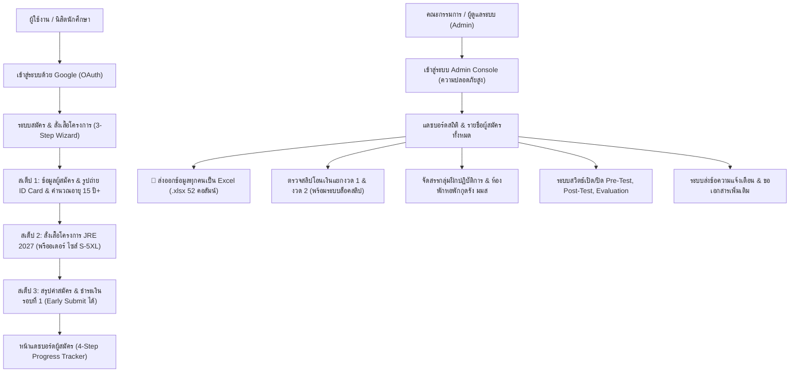

# 🚒 JRE-2027 | ระบบสารสนเทศและรับสมัครโครงการฝึกอบรมเชิงปฏิบัติการกู้ภัยนักศึกษาทั่วประเทศ (ทุกภูมิภาค)
> **Joint Response Exercise 2027 (JRE 2027)**  
> 🏛️ จัดโดย: **ชมรมกู้ภัยราชพฤกษ์ สังกัดองค์การนิสิต มหาวิทยาลัยมหาสารคาม (มมส)**  
> 🤝 ภาคีเครือข่ายร่วม: **ชมรมอาสาสมัครกู้ภัย มหาวิทยาลัยขอนแก่น (มข.)**, **ชมรมจิตอาสาแสดทอง มทส.**, **ชมรมปฏิบัติการกู้ภัย มช.**, **ชมรมกู้ชีพกู้ภัย มกส.**, **ชมรมอาสาสมัครกู้ชีพ-กู้ภัย มรภ.อุดรธานี**, **ชมรมนักวิทยุสมัครเล่นและอาสาบรรเทาภัย (วลัยอาสา) มวล.**, **ชมรมกู้ชีพ-กู้ภัย มก.ฉกส.** และเครือข่ายกู้ภัยนิสิตนักศึกษาทั่วประเทศ ทุกภูมิภาค  
> 📅 วันที่จัดกิจกรรม: **14 - 15 พฤศจิกายน 2569 (2 วัน 1 คืน)** ณ มหาวิทยาลัยมหาสารคาม  
> 🛏️ ที่พักค้างแรม: **หอพักกุดรัง มหาวิทยาลัยมหาสารคาม** (ห้องปรับอากาศ, เครื่องทำน้ำอุ่น, หมอน, ผ้าห่ม, โต๊ะเขียนงาน, ตู้เสื้อผ้า)

---

## 🎯 วัตถุประสงค์ในการสร้างระบบ (Project Objectives)

1. **ยกระดับและบูรณาการขีดความสามารถการกู้ภัยฉุกเฉิน (Rescue Capacity Building):**  
   เพื่อเป็นศูนย์กลางสารสนเทศในการประสานงาน ถ่ายทอดองค์ความรู้ และเตรียมความพร้อมในการเผชิญเหตุสาธารณภัย อุบัติเหตุหมู่ และภัยพิบัติต่าง ๆ ให้แก่นิสิตนักศึกษาสมาชิกภาคีเครือข่ายกู้ภัยจากมหาวิทยาลัยทั่วประเทศไทย
2. **ระบบรับสมัครและพรีออเดอร์เสื้อโครงการแบบครบวงจรในที่เดียว (Unified Registration & Pre-order System):**  
   รวมขั้นตอนการสมัครเข้าร่วมโครงการและการสั่งผลิตเสื้อฝึกภาคีเครือข่าย (คอเต่าซิป แขนสั้น โทนสีเทา-ดำ) เข้าเป็นระบบเดียวกัน พร้อมตัวเลือกแบ่งจ่ายค่าธรรมเนียม 2 งวด และระบบส่งข้อมูลให้แอดมินล่วงหน้า (Early Submission)
3. **ระบบยืนยันตัวตนและความปลอดภัยข้อมูลระดับสถาบัน (Enterprise Authentication & Security):**  
   เชื่อมต่อการยืนยันตัวตนผ่าน Google OAuth เพื่อความถูกต้องของข้อมูลผู้สมัคร ป้องกันบัญชีซ้ำซ้อน และสอดคล้องตามพระราชบัญญัติคุ้มครองข้อมูลส่วนบุคคล (PDPA) ของมหาวิทยาลัยมหาสารคาม
4. **การบริหารจัดการภาคสนามแบบเรียลไทม์ (Tactical Field Management):**  
   ช่วยให้คณะกรรมการผู้จัดงานสามารถจัดสรรกลุ่มฝึกปฏิบัติการ (Group Assignment), จัดสรรห้องพักค้างแรม (Room Assignment), คัดกรองข้อมูลสุขภาพ/โรคประจำตัวเพื่อการดูแลพิเศษ (Special Care), ควบคุมการทำแบบทดสอบ (Pre-Test / Post-Test / Evaluation) และส่งออกข้อมูลผู้สมัครทั้งหมดเป็นไฟล์ Excel (`.xlsx`) ได้ในคลิกเดียว

---

## 🌟 ฟีเจอร์หลักและโมดูลทั้งหมดของระบบ (System Modules & Features)



### 1. 👤 ระบบเข้าสู่ระบบ & ยืนยันตัวตนด้วย Google (Google OAuth)
- ดึงชื่อ-นามสกุล, อีเมล, และรูปภาพโปรไฟล์ (Google Avatar) อัตโนมัติ ป้องกันการกรอกข้อมูลเท็จหรือสร้างบัญชีซ้ำ
- แยกสิทธิ์การใช้งานระหว่างผู้สมัครทั่วไปและผู้ดูแลระบบอย่างเข้มงวด

### 2. 📝 ระบบรับสมัครและสั่งเสื้อโครงการแบบ 3 ขั้นตอน (Unified 3-Step Wizard)
- **ขั้นตอนที่ 1 — ข้อมูลผู้สมัคร & รูปถ่าย ID Card:**
  - คำนำหน้า ชื่อ-สกุล (ตัวย่อสถานศึกษา) ภาษาไทยและภาษาอังกฤษ
  - ชื่อเล่น (ไทย/อังกฤษ) และรหัสนามเรียกขานหน่วยตัวเอง (เช่น `RCPMSU 15-01`)
  - สังกัด/มหาวิทยาลัย/ชมรมกู้ภัยทั่วประเทศ (มี Dropdown และปุ่ม Quick Picker 8 สถาบันเครือข่าย)
  - ระบบคำนวณอายุแบบเรียลไทม์ (ปี เดือน วัน) บังคับเกณฑ์อายุ **15 ปีบริบูรณ์ขึ้นไป**
  - ตรวจสอบเบอร์โทรศัพท์มือถือและเบอร์โทรฉุกเฉินบังคับ **10 หลักพอดี**
  - อัปโหลด **รูปถ่ายสำหรับทำ ID Card** (ชุดสุภาพ หน้าตรง พร้อม Auto-resize และ Preview)
  - ข้อมูลสุขภาพ, โรคประจำตัว, ประวัติแพ้ยา/อาหาร, และประวัติการฝึกอบรมกู้ภัยที่ผ่านมา
  - ระบบ Auto-Save Draft ลง LocalStorage ป้องกันข้อมูลสูญหาย
- **ขั้นตอนที่ 2 — สั่งเสื้อโครงการ JRE 2027 (บังคับสั่งแบบพรีออเดอร์):**
  - เสื้อฝึกทางการ: **เสื้อคอเต่าซิป แขนสั้น โทนสีเทา–ดำ**
  - ตำแหน่งงานปัก/สกรีน: อกซ้าย (โลโก้ภาคีเครือข่าย), อกขวา (ตัวย่อหน่วย/มหาลัย), ด้านหลัง (*"ฝึกผสมภาคีเครือข่าย"* JRE 2027)
  - ตัวอย่างรูปภาพเสื้อความละเอียดสูง พร้อมปุ่มเปิด Modal ดูตารางไซส์เสื้อ (นิ้ว)
  - ตัวเลือกไซส์เสื้อ: **S, M, L, XL, 2XL, 3XL, 4XL, 5XL**
- **ขั้นตอนที่ 3 — สรุปค่าสมัคร & ชำระเงินรอบที่ 1 / ส่ง Admin ทันที (Early Submission):**
  - การ์ดสรุปข้อมูลผู้สมัคร, รหัสนามเรียกขาน, สังกัด, ไซส์เสื้อ, และยอดรวมค่าธรรมเนียม
  - **ระบบส่งข้อมูลให้ Admin ได้ก่อน (Early Submit):** ผู้สมัครสามารถกดส่งข้อมูลและรายการสั่งเสื้อให้ Admin ได้ทันทีแม้ยังไม่ได้โอนเงิน โดยระบบจะบันทึกสถานะ *"ค้างชำระงวดที่ 1 จำนวน 400 บาท"* ให้ทันที เพื่อให้กลับมาแนบสลิปภายหลังได้
  - ข้อมูลบัญชีธนาคารไทยพาณิชย์ (SCB) `594-264865-5` **นางสาวมัญชุพร ยังเหล็ก** พร้อมปุ่มคัดลอก 1-คลิก
  - ช่องอัปโหลดสลิปโอนเงินรอบที่ 1 (400 บาท)
  - ข้อตกลงรับรองความถูกต้องของข้อมูล และนโยบาย PDPA มหาวิทยาลัยมหาสารคาม

### 3. 📊 หน้าแดชบอร์ดผู้เข้าร่วมโครงการ (Participant Dashboard 4-Step Tracker)
- แสดงวันเวลาที่สมัคร (`created_at`), รหัสอ้างอิงใบสมัคร, รูปถ่ายทำ ID Card ขยายดูได้, นามเรียกขาน (`📡`), ไซส์เสื้อ (`👕`)
- แบนเนอร์สถานะการเงินรวม: แสดงสถานะชำระครบ 100% หรือยอดค้างชำระอย่างชัดเจน
- **การ์ดติดตามความคืบหน้า 4 ขั้นตอน:**
  - **สเต็ป 1:** ข้อมูลผู้สมัคร & รูปทำ ID Card (สถานะยืนยันข้อมูลแล้ว)
  - **สเต็ป 2:** เสื้อฝึก JRE 2027 (แสดงไซส์เสื้อที่สั่งผลิตพรีออเดอร์)
  - **สเต็ป 3:** งวดที่ 1 ชำระ 400 บาท (ค่าจัดทำเสื้อ: ชำระแล้ว / รอตรวจ / ค้างชำระ พร้อมปุ่มแนบสลิป)
  - **สเต็ป 4:** งวดที่ 2 ชำระ 450/250 บาท (ค่าที่พักและอาหาร: ชำระแล้ว / รอตรวจ / ค้างชำระ พร้อมปุ่มแนบสลิป)
- **การจัดสรรภาคสนามจาก Admin:**
  - แสดงกลุ่มฝึกปฏิบัติการที่สังกัด (`group_assigned`)
  - แสดงห้องพักค้างแรม ณ หอพักกุดรัง มมส (`room_assigned`)
  - หมายเหตุการดูแลพิเศษจากทีมแพทย์สนาม/คณะกรรมการ (`is_special_care`)
- **การ์ดแบบทดสอบและประเมินผล:** ลิงก์ทำ Pre-Test, Post-Test, และแบบประเมินความพึงพอใจ พร้อมภาพแบนเนอร์ทางการ
- **ระบบนำส่งเอกสารเพิ่มเติม (Requested Docs):** อัปโหลดไฟล์เอกสารตามที่ Admin ร้องขอ พร้อมพรีวิวในแอป

### 4. 👕 หน้าข้อมูลเสื้อและตารางไซส์แยก URL (`/merchandise`)
- หน้าแสดงรูปเสื้อฝึกทางการ, รายละเอียดเนื้อผ้า, สเปกงานปัก/สกรีนทั้ง 3 ตำแหน่ง, และตารางขนาดไซส์อย่างละเอียด
- แบนเนอร์ด้านบนพร้อมปุ่มเชื่อมโยง `👉 สั่งซื้อเสื้อพร้อมสมัครเข้าร่วมโครงการ JRE 2027` ไปยังหน้า `/register` ทันที

### 5. 🛠️ ระบบผู้ดูแลระบบ (Advanced Admin Console)
- เข้าสู่ระบบปลอดภัยผ่าน Environment Variables พร้อมปุ่มเปิด/ปิดดูรหัสผ่าน
- **📗 ส่งออกข้อมูลผู้สมัครทุกคนเป็น Excel (`.xlsx`):** ส่งออกทุกมิติครบทั้ง **52 คอลัมน์** (ประวัติ, ID Card, เสื้อ, สลิป 3 รายการ, ยอดเงิน, กลุ่ม, ห้องพัก, ประวัติการแพทย์, วันเวลา)
- ระบบตรวจสอบและอนุมัติสลิปแยกงวด 1, งวด 2, และชำระเต็มจำนวน พร้อมระบบล็อคสลิปหลังอนุมัติ
- ระบบจัดสรรกลุ่มฝึก (Group Assignment) และจัดห้องพักหอพักกุดรัง มมส (Room Assignment)
- ระบบตั้งค่าสวิตช์เปิด/ปิด และแก้ไข URL แบบทดสอบ Pre-Test, Post-Test, Evaluation แบบเรียลไทม์
- ระบบส่งข้อความแจ้งเตือนส่วนบุคคล (Direct Messaging) และขอเอกสารเพิ่มเติม

### 6. 📅 กำหนดการและเอกสารทางการ (Official PDF & Schedule)
- กำหนดการ 2 วัน 1 คืน แสดงสถานที่อย่างชัดเจน (ห้องประชุมใหญ่ อาคารบรมราชกุมารี, สนามหญ้าส่วนกลาง, สระว่ายน้ำ มมส, หอฝึกจำลอง, หอพักกุดรัง มมส)
- ปุ่มเปิดอ่านและดาวน์โหลดไฟล์เอกสารกำหนดการทางการรูปแบบ PDF

---

## 💰 โครงสร้างค่าใช้จ่ายและการแบ่งชำระ 2 งวด (Payment Tiers)

| กลุ่มผู้เข้าร่วม | ยอดรวมทั้งสิ้น | งวดที่ 1 (พร้อมสมัคร 15–20 ต.ค. 2569) | งวดที่ 2 (1–5 พ.ย. 2569) | หมายเหตุ |
|---|---|---|---|---|
| **ต่างมหาวิทยาลัย / ภาคีภายนอก** | **850 บาท/คน** | **400 บาท** (ค่าจัดทำเสื้อพรีออเดอร์) | **450 บาท** (ค่าอาหารและที่พัก) | รวมค่าที่พักหอพักกุดรัง มมส (ห้องแอร์) |
| **นิสิตมหาวิทยาลัยมหาสารคาม (มมส)** | **650 บาท/คน** | **400 บาท** (ค่าจัดทำเสื้อพรีออเดอร์) | **250 บาท** (ค่าอาหารและกิจกรรม) | ไม่มีค่าใช้จ่ายด้านที่พัก |

> **ข้อมูลบัญชีธนาคารทางการ:**  
> ธนาคารไทยพาณิชย์ (SCB) เลขที่บัญชี **`594-264865-5`**  
> ชื่อบัญชี: **นางสาวมัญชุพร ยังเหล็ก** (เบอร์โทร/พร้อมเพย์: **`098-329-6762`**)

---

## 🎓 เกณฑ์ประเมินโครงงาน Web Application & การป้องกันการโจมตี (Academic Compliance & Security Defense)

โครงงานนี้ได้รับการออกแบบและพัฒนาให้สอดคล้องตามข้อกำหนดของรายวิชาการพัฒนาเว็บแอปพลิเคชัน (Web Application Development) ครบถ้วน 100% ตามเกณฑ์ 20 คะแนน (ความสมบูรณ์และระบบป้องกันการโจมตี 10 คะแนน, ตอบคำถามและนำเสนอในชั้นเรียน 5 คะแนน, ลิงก์โฮสต์ก่อนกำหนด 5 คะแนน):

### 📋 ตารางสรุปการผ่านเกณฑ์ขั้นต่ำ 5 ข้อบังคับ:

| ข้อบังคับของอาจารย์ | การตอบสนองในระบบ JRE 2027 | สถานะ | ไฟล์โค้ดหลักที่เกี่ยวข้อง |
|---|---|:---:|---|
| **1. สมัครสมาชิก & เข้าสู่ระบบ + Password Hashing** | • สมัครสมาชิกด้วย Email & Password พร้อมปุ่มเปิด/ปิดดูลูกตา<br>• มีระบบ **Password Hashing** ด้วย **SHA-256 + 16-byte Dynamic Hex Salt** ผ่าน Web Crypto API ก่อนบันทึก<br>• ระบบกู้คืนรหัสผ่าน (Forgot Password) และส่ง OTP Verification Code<br>• สถาปัตยกรรม **Dual-Bypass Authentication** (เชื่อมโยง Google OAuth และ Email/Password ได้อย่างไร้รอยต่อ) | ✅ ผ่าน 100% | [`src/utils/cryptoUtils.js`](src/utils/cryptoUtils.js)<br>[`src/components/GoogleLoginModal.jsx`](src/components/GoogleLoginModal.jsx)<br>[`src/supabase.js`](src/supabase.js) |
| **2. ผู้ใช้อย่างน้อย 2 บทบาท (Roles)** | • **User / Member:** สมัครเข้าร่วมโครงการ, สั่งจองเสื้อ, ดูแดชบอร์ดส่วนตัว, แก้ไขใบสมัคร, จัดการบัญชี, ลบข้อมูลของตนเอง<br>• **Admin (ผู้ดูแลระบบ):** เข้าสู่ระบบผ่านพอร์ทัลความปลอดภัย, อนุมัติสลิป, จัดกลุ่ม/ห้องนอน, ส่งออก Excel ทุกคอลัมน์, จัดการสินค้า, และจัดการบัญชีผู้ใช้ (เพิ่ม/แก้ไข/รีเซ็ตรหัสผ่าน/ลบ) | ✅ ผ่าน 100% | [`src/App.jsx`](src/App.jsx)<br>[`src/views/AdminDashboardView.jsx`](src/views/AdminDashboardView.jsx)<br>[`src/components/AdminLoginModal.jsx`](src/components/AdminLoginModal.jsx) |
| **3. ฟีเจอร์ CRUD ครบชุดที่มี "เจ้าของ" (Ownership Protection)** | • **Create (C):** ส่งใบสมัครและสั่งจองเสื้อโครงการ (Wizard 3 ขั้นตอน)<br>• **Read (R):** เรียกดูแดชบอร์ดใบสมัครเฉพาะของตนเอง (`user_id === user.id`)<br>• **Update (U):** แก้ไขข้อมูลประวัติใบสมัคร & ข้อมูลบัญชีผู้ใช้/เปลี่ยนรหัสผ่าน<br>• **Delete (D):** ปุ่ม **"ยกเลิกใบสมัครและลบข้อมูลของฉัน"** พร้อมการตรวจสอบสิทธิ์ `IDOR Protection` ป้องกันไม่ให้ User A ลบข้อมูลของ User B | ✅ ผ่าน 100% | [`src/views/RegisterView.jsx`](src/views/RegisterView.jsx)<br>[`src/supabase.js`](src/supabase.js) (`deleteRegistrationByOwner`) |
| **4. ฟอร์มรับข้อมูลอย่างน้อย 2 ฟอร์ม** | • **ฟอร์มที่ 1:** ใบสมัครเข้าร่วมโครงการ 3-Step Wizard (ประวัติ, ID Card, ประวัติการแพทย์, แผนแบ่งจ่าย)<br>• **ฟอร์มที่ 2:** ระบบสั่งจองเสื้อ Merchandise & ชำระเงิน (เลือกสินค้า, ขนาดไซส์, คำนวณราคา, แนบสลิป, ตรวจสอบสถานะ)<br>• ข้อมูลทุกฟอร์มถูกบันทึกลง Database และแสดงผลสะท้อนกลับมายังแดชบอร์ด | ✅ ผ่าน 100% | [`src/views/RegisterView.jsx`](src/views/RegisterView.jsx)<br>[`src/views/MerchandiseView.jsx`](src/views/MerchandiseView.jsx) |
| **5. หน้าผู้ดูแลระบบอย่างน้อย 1 หน้า** | • **Admin Console:** ระบบควบคุมแบบรวมศูนย์ 8 แท็บ:<br>1. จัดการผู้สมัคร (ตรวจสลิป, จัดกลุ่ม, จัดห้องพัก)<br>2. ตั้งค่าค่าธรรมเนียมและงวดชำระ<br>3. สวิตช์เปิด/ปิดข้อสอบ Pre-Test/Post-Test/Evaluation<br>4. ประกาศข่าวสารและคำสั่ง<br>5. จัดการสินค้าและออเดอร์เสื้อ<br>6. ทำเนียบวิทยากร<br>7. ทำเนียบคณะทำงาน<br>8. **จัดการบัญชีผู้ใช้ (User Accounts & Password Hash Inspector)** | ✅ ผ่าน 100% | [`src/views/AdminDashboardView.jsx`](src/views/AdminDashboardView.jsx) |

---

### 🛡️ ระบบการป้องกันการโจมตี (Security & Attack Prevention - 10 คะแนนเต็ม)

1. **Cryptographic Password Hashing (OWASP Compliant):**
   - รหัสผ่านไม่ได้ถูกจัดเก็บในรูป Plaintext อย่างเด็ดขาด
   - ระบบใช้ Web Crypto API มาตรฐานระดับสากล (`crypto.subtle.digest('SHA-256', ...)`) ร่วมกับการสุ่มเกลือ (Dynamic Salt) ขนาด 16 ไบต์ (`crypto.getRandomValues(new Uint8Array(16))`)
   - ป้องกันการโจมตีแบบ **Rainbow Table Attack**, **Dictionary Attack**, และ **Brute Force Attack**
   - มี **Password Hash Inspector Modal** ในหน้า Admin สำหรับให้อาจารย์คลิกดูค่า Salt และค่า Hash จริงที่ถูกจัดเก็บในฐานข้อมูล

2. **Insecure Direct Object Reference (IDOR) Protection:**
   - ในการแก้ไขหรือลบข้อมูลใบสมัคร ระบบตรวจสอบ Strict Ownership:
     ```javascript
     if (myRegistration.user_id !== user.id && myRegistration.id !== user.id) {
       throw new Error('ไม่อนุญาต: คุณสามารถลบได้เฉพาะข้อมูลใบสมัครของตนเองเท่านั้น (IDOR Protection)');
     }
     ```
   - ป้องกันไม่ให้ผู้ใช้ A สามารถปลอมแปลง Request Parameter เพื่อแก้ไขหรือลบข้อมูลของผู้ใช้ B

3. **Cross-Site Scripting (XSS) Prevention:**
   - React Virtual DOM ทำการ Auto-escaping อักขระพิเศษ HTML ทั้งหมดโดยอัตโนมัติ
   - ลิงก์ภายนอกทั้งหมดมีการกำหนด `rel="noopener noreferrer"` ป้องกันการโจมตีแบบ Reverse Tabnabbing

4. **SQL / NoSQL Injection Prevention:**
   - ทุกคำสั่ง Query ในฐานข้อมูล Supabase ถูกประมวลผลผ่าน Parameterized Queries และ ORM Prepared Statements ป้องกันการแทรกคำสั่ง SQL แปลกปลอม

5. **Client-Side & Server-Side Strict Validation:**
   - ตรวจสอบรูปแบบอีเมลตาม RFC 5322 Regex
   - บังคับความยาวรหัสผ่านไม่น้อยกว่า 6 ตัวอักษร
   - ตรวจสอบเบอร์โทรศัพท์ 10 หลักบริบูรณ์
   - บังคับเกณฑ์อายุผู้สมัครอย่างน้อย 15 ปีบริบูรณ์ผ่านปฏิทิน พ.ศ. อัจฉริยะ

6. **PDPA Compliance (Data Privacy):**
   - มีข้อตกลงความยินยอมข้อมูลส่วนบุคคล (PDPA Consent Modal) ตามมาตรฐานมหาวิทยาลัยมหาสารคาม ก่อนการส่งข้อมูลทุกครั้ง

---

## 🔄 บันทึกการอัปเดตและปรับปรุงระบบล่าสุด (Changelog & Recent Updates)

- **feat(register):** รวมระบบสมัครและระบบสั่งซื้อเสื้อโครงการเข้าเป็นระบบเดียวกัน (Unified 3-Step Wizard)
  - Step 1: ข้อมูลผู้สมัคร, ID Card Photo, คำนวณอายุ 15 ปี+, เบอร์โทร 10 หลัก
  - Step 2: เลือกลายเสื้อและขนาดไซส์เสื้อพรีออเดอร์ (S–5XL)
  - Step 3: สรุปค่าสมัคร & ชำระเงินรอบที่ 1 พร้อมตัวเลือกส่งข้อมูลให้ Admin ได้ก่อน (Early Submit)
- **feat(export):** พัฒนาระบบส่งออกข้อมูลผู้สมัครทุกคนเป็น Excel (`.xlsx`) ครบทั้ง 52 คอลัมน์ รองรับภาษาไทยสมบูรณ์แบบด้วยไลบรารี `xlsx` (SheetJS)
- **feat(dashboard):** เพิ่มระบบติดตามความคืบหน้า 4 ขั้นตอน (4-Step Visual Tracker) สำหรับผู้สมัคร พร้อมแบนเนอร์แสดงสถานะยอดค้างชำระ/ชำระครบถ้วน
- **feat(merchandise):** สร้างหน้าแคตตาล็อกเสื้อและตารางไซส์แยก URL (`/merchandise`) พร้อมปุ่ม CTA ไปหน้าสมัคร
- **feat(forms):** อัปเดตแบนเนอร์และลิงก์ทางการสำหรับ Pre-Test, Post-Test, และแบบประเมินความพึงพอใจ JRE 2027
- **feat(network):** เพิ่มระบบตัวเลือกด่วน 8 สถาบันกู้ภัยเครือข่ายทั่วประเทศ พร้อมคำนวณยอดเงินตามสถาบันอัตโนมัติ
- **feat(dormitory):** อัปเดตข้อมูลหอพักกุดรัง มมส พร้อมแสดงสิ่งอำนวยความสะดวก (แอร์, น้ำอุ่น, หมอน, ผ้าห่ม)

---

## 💻 เทคโนโลยีที่ใช้ในการพัฒนา (Tech Stack)

- **Frontend Core:** [React 19](https://react.dev/), [Vite 6](https://vitejs.dev/)
- **Styling & UI:** [Tailwind CSS 3](https://tailwindcss.com/), [Lucide React](https://lucide.dev/) Icons, [Canvas Confetti](https://www.npmjs.com/package/canvas-confetti)
- **Data Export:** [SheetJS (xlsx 0.18.5)](https://sheetjs.com/) สำหรับการสร้างไฟล์ Excel `.xlsx`
- **Authentication & Backend:** [Supabase](https://supabase.com/) (PostgreSQL Database, Storage Buckets, Auth)
- **Deployment Platform:** [Vercel](https://vercel.com/) (Serverless & Edge CDN)

---

## 🚀 วิธีการ Deploy ขึ้น Production (Vercel Deployment)

### ขั้นตอนที่ 1: Deploy ผ่าน Vercel Dashboard
1. นำเข้า Repository [developerrcpmsu-dev/JRE-2027](https://github.com/developerrcpmsu-dev/JRE-2027) บน Vercel
2. เลือก Framework Preset เป็น **Vite**
3. Build Command: `npm run build`
4. Output Directory: `dist`

### ขั้นตอนที่ 2: ตั้งค่า Environment Variables ใน Vercel
กำหนดค่า Environment Variables ในหน้า **Project Settings > Environment Variables**:

| Variable Name | รายละเอียด | ตัวอย่างค่า |
|---|---|---|
| `VITE_ADMIN_USERNAME` | ชื่อผู้ใช้สำหรับเข้าสู่ระบบ Admin | `admin_jre2027` |
| `VITE_ADMIN_PASSWORD` | รหัสผ่านสำหรับ Admin Console | `ตั้งรหัสผ่านความปลอดภัยสูง` |
| `VITE_SUPABASE_URL` | URL ของโครงการ Supabase | `https://xxxx.supabase.co` |
| `VITE_SUPABASE_ANON_KEY` | Public Anon Key ของ Supabase | `eyJhbGciOi...` |

---

## 🗄️ การตั้งค่าฐานข้อมูล Supabase (Database Setup)

1. เข้าไปยัง [Supabase Dashboard](https://supabase.com/dashboard)
2. ไปที่เมนู **SQL Editor** แล้วรันสคริปต์จากไฟล์ `supabase_schema.sql` เพื่อสร้างตาราง `registrations`, `announcements`, และ `config`
3. ไปที่เมนู **Storage** และสร้าง Public Buckets ดังนี้:
   - `slips` — สำหรับจัดเก็บภาพสลิปโอนเงิน
   - `docs` — สำหรับจัดเก็บเอกสารที่ผู้สมัครแนบ
   - `avatars` — สำหรับจัดเก็บรูปถ่ายทำ ID Card

---

## 🛠️ การรันและทดสอบในเครื่องคอมพิวเตอร์ (Local Development)

```bash
# 1. ติดตั้ง Dependencies ทั้งหมด
npm install

# 2. เริ่มรัน Development Server (ค่าเริ่มต้น http://localhost:5173)
npm run dev

# 3. ตรวจสอบการ Build สำหรับ Production
npm run build

# 4. ทดสอบพรีวิวผลลัพธ์ Production Build ในเครื่อง
npm run preview
```

---

## 📞 ติดต่อประสานงานโครงการ

- **ชมรมกู้ภัยราชพฤกษ์ มหาวิทยาลัยมหาสารคาม (มมส)**  
- ☎️ โทรศัพท์ผู้ประสานงาน: **098-329-6762**  
- 🌐 GitHub Repository: [developerrcpmsu-dev/JRE-2027](https://github.com/developerrcpmsu-dev/JRE-2027)
